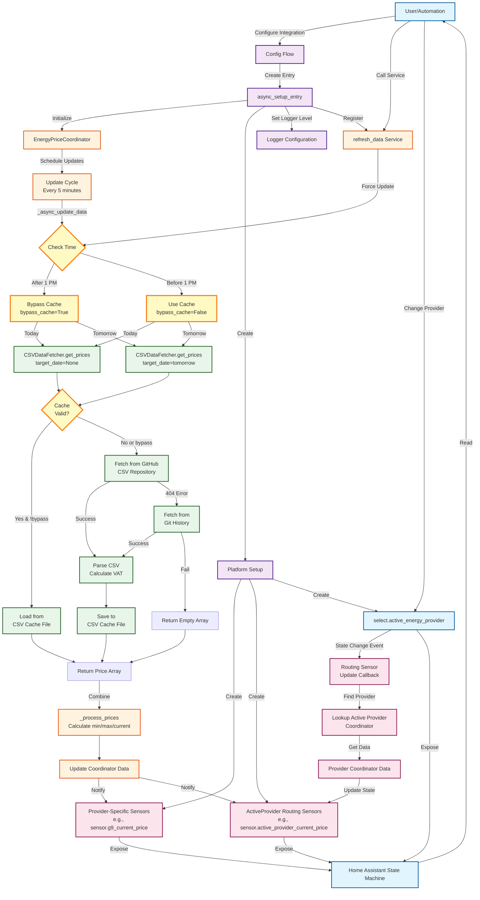

# Data Flow Architecture

This document describes the data flow within the Portuguese Energy Price Tracker integration for Home Assistant.

## Architecture Diagram



## Component Descriptions

### User Interaction Layer
- **User/Automation**: Home Assistant users or automations that interact with the integration
- **Config Flow**: UI-based configuration for adding/editing providers
- **select.active_energy_provider**: Dropdown to select which provider's data to display in routing sensors

### Configuration Layer
- **async_setup_entry**: Initializes the integration when a config entry is loaded
- **Logger Configuration**: Sets DEBUG or INFO level based on user's "Enable Debug Logging" option
- **Platform Setup**: Creates sensor and select platforms

### Coordinator Layer
- **EnergyPriceCoordinator**: DataUpdateCoordinator that manages data fetching and updates
- **Update Cycle**: Runs every 5 minutes (SCAN_INTERVAL) to fetch fresh data
- **Check Time**: After 1 PM, uses `bypass_cache=True` for tomorrow's data to ensure fresh fetch
- **_process_prices**: Calculates current price, today's min/max, tomorrow's min/max

### Data Fetching Layer
- **CSVDataFetcher**: Handles fetching and caching CSV data from GitHub
- **Cache Check**: Verifies if cached data exists and is valid (< 1 hour old)
- **GitHub CSV Repository**: Primary data source for current prices
- **Git History**: Fallback for historical data when CSV file doesn't exist yet
- **CSV Cache File**: Disk cache stored in `custom_components/portuguese_energy_price_tracker/data/`

### Sensor Layer
- **Provider-Specific Sensors**: Direct sensors for each configured provider (e.g., `sensor.g9_current_price`)
- **ActiveProvider Routing Sensors**: Generic sensors that automatically route to the active provider's data
- **Routing Update Callback**: Listens for select entity state changes and forces sensor updates

## Data Flow Scenarios

### Normal Update Cycle (Before 1 PM)
1. Coordinator triggers update every 5 minutes
2. Fetches today's data with cache (if valid)
3. Fetches tomorrow's data with cache (if valid)
4. Combines data and updates all sensors
5. Routing sensors read from active provider's coordinator

### Smart Cache Bypass (After 1 PM)
1. Coordinator detects time >= 13:00
2. Fetches today's data with cache (if valid)
3. **Bypasses cache** for tomorrow's data, always tries GitHub
4. Continues retrying fresh fetch until tomorrow's data is available
5. Once available, data is cached and normal behavior resumes

### Provider Switch via select.active_energy_provider
1. User changes select entity value
2. Select entity fires state_changed event
3. Routing sensors receive event in `_update_callback`
4. Routing sensors call `force_refresh=True` to notify frontend
5. Sensors look up new provider's coordinator data
6. ApexCharts and UI components receive update notifications

### Manual Refresh via Service
1. User calls `portuguese_energy_price_tracker.refresh_data`
2. Service handler iterates all coordinators
3. Each coordinator fetches with `bypass_cache=True`
4. Optional: specific date can be requested for historical lookup
5. Updates only affect coordinator data if date == today

## Caching Strategy

### Memory Cache
- Stores in-progress fetch operations to prevent duplicate requests
- Cleared after data is successfully fetched

### Disk Cache
- CSV files stored per date: `prices_YYYY-MM-DD.csv`
- Valid for 1 hour after creation
- Shared between all provider/tariff instances
- Not deleted when providers are removed (shared resource)

### Cache Bypass Logic
```python
# After 1 PM, always try to fetch fresh data for tomorrow
should_bypass_cache = datetime.now().hour >= 13

tomorrow_prices = await csv_fetcher.get_prices(
    target_date=tomorrow,
    bypass_cache=should_bypass_cache  # True after 1 PM
)
```

## Sensor Update Propagation

```
Coordinator Data Change
    ↓
Provider-Specific Sensors Updated (immediate)
    ↓
Select Entity Changed (if user switches provider)
    ↓
state_changed Event Fired
    ↓
Routing Sensors _update_callback
    ↓
force_refresh=True
    ↓
Frontend Notified
    ↓
ApexCharts/UI Components Re-render
```

## Key Design Decisions

1. **Smart Cache Bypass**: Only after 1 PM to reduce GitHub API calls while ensuring timely data availability
2. **Routing Sensors**: Allow seamless provider switching without reconfiguring dashboards/automations
3. **Shared CSV Cache**: Reduces redundant fetches across multiple provider instances
4. **Git History Fallback**: Provides historical data access for dates without published CSV files
5. **Force Refresh on Select Change**: Ensures UI updates even when numeric values appear similar between providers
6. **Debug Logging Option**: Users can enable detailed logging without editing configuration.yaml

## Error Handling

### CSV Fetch Failures
- GitHub 404 → Try Git history
- Git history fail → Return empty array
- Sensors display `None` or `Unknown`

### Empty Tomorrow Data
- Before 1 PM: Normal, uses cache or returns empty
- After 1 PM: Retries fresh fetch every 5 minutes until available
- Sensors for tomorrow show `None` until data arrives

### Coordinator Errors
- Logged with stack trace
- Raises `UpdateFailed` to prevent bad data
- Retries on next update cycle
